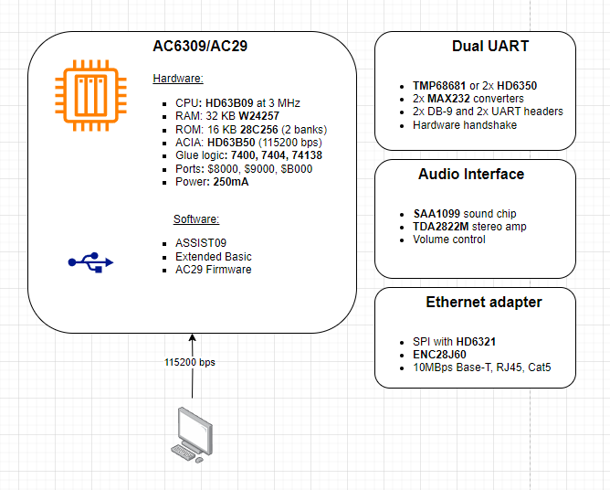

# AC6309
A minimalistic industrial computer core, based on Motorola 6809 platform.

## Purpose
Proof of concept custom industrial computer with minimal device count implementation. Modular, low-power design, allowing easy expansion and customization per use case.

## Configuration AC29
The main board AC29 rev.1:
* CPU: 68B09/63B09, 68C09/63C09, non-E version
* Clock: 1.8MHz (7.3782MHz crystal)
* RAM: W24257
* ROM: 28C128/28C256
* UART: 63B50 with FT23 header
* Address decoding: 74HCT00 and 74HCT138 for 4+ devices
* 2x20-pin expansion port with address, data and control lines
* Power over USB or expansion port

## Prototype unit
* CPU: Hitachi HD63B09 @ 1.8MHz
* RAM: 32KB Winbond W24257A
* ROM: 16KB Atmel 28C256 EEPROM (one half)
* UART: Hitachi HD63B50 (1MBps) on FT23 USB Serial
* Address decoding: 74HCT00 and 74HCT138 for 4+ devices
* 2x20-pin expansion port with address, data and control lines
* Power over USB or expansion port

## Dedication
AC29 is dedicatd to my father.

## System memory map
|Address range|Device|Size|
|-------------|------|----|
|$0000-$7FFF|RAM|32KB|
|$8000-$8FFF|Extension port #1|4KB|
|$9000-$9FFF|Extension port #2|4KB|
|$A000-$AFFF|UART|4KB|
|$B000-$BFFF|Extension port #3|4KB|
|$C000-$FFFF|ROM|16KB|

The entire 32KB of RAM is allocated from the bottom of the address range $0000 to $7FFF.
The ROM is allocated at top 16KB of the address space starting $C000 to $FFFF.

The I/O mapping is temporary and to allow compatibility with existing BIOS images having ACIA on address 0xA000. 

### Work in progress: I/O update

|Address range|Device|Size|
|-------------|------|----|
|$0000-$7FFF|RAM|32KB|
|$8000-$8FFF|Unallocated|4KB|
|$9000-$9FFF|Unallocated|4KB|
|$A000-$AFFF|I/O|4KB|
|$B000-$BFFF|Unallocated|4KB|
|$C000-$FFFF|ROM|16KB|

The I/O being split into four pieces is forming the ACIA and the 3 extension port select lines with the following addressing:
|Address range|Device|Size|
|-------------|------|----|
|$A000-$A3FF|UART|1KB|
|$A400-$A7FF|Extension port #1|1KB|
|$A800-$ABFF|Extension port #2|1KB|
|$AC00-$AFFF|Extension port #3|1KB|

## Decoding logic and CS lines
ROM: When ROM_CS is LOW (active low). The signal is produced by one NAND gate fed with A14 and A15 lines.

RAM: When A15 signal is LOW (the second half (16KBytes) of the address space).

ACIA: Using A13, A14 and A15 for the CS0, CS1 and CS2 registers respectively.

## Writing the ROM image
Using the combination ROM image in Intel HEX format it needs first be turned into a binary image to be written to the EEPROM.
> objcopy -I ihex -O binary combined.hex combined.bin

Write the resulting .bin file using the specially created EEPROM programmer for AT28C-series EEPROMs. Or any other.
> promdude.exe -combined.bin

As a note, burning the combined.bin (16K) onto 32K 28C256 has to be at the correct half. Optionally, a copy of combined.bin twice into the chip will do as well.

## ROM switching
As the firmware is 16K and 28C256 chips are nowadays more accesible, two firmwares could be stored in the 32K. A possible rom switching key can be implemented on the board, to switch the higher or lower part of the chip to be "visible"  (A15).

## Communication
The system communicates with a host computer via USB serial connection using the included ACIA device and its UART capability, coupled with an FT23 header. Host computer serial port settings: 115200 baud, 8n1, no hardware handshake.

## Software
Main goals for the first runs of the project:
- [x] Run ASSIST09 and Extended BASIC
- [x] Write basic program (asm)
- [x] Cross-compile on host machine
- [x] Easy program transer via ASSIST09 Load (S19)
- [ ] Use of high level C code (CMOC)

## Hardware
Main goals for the fabrication part:
- [x] Breadboard prototype running
- [ ] Extended addressing with 74138
- [ ] PCB or Perfboard prototype
- [ ] Expansion card: TMP68681 / 2x RS232
- [ ] Expansion card: SPI + Ethernet port (ENC28J60)
- [ ] Expansion card: SAA1099 sound
- [ ] Expansion card: Am9511 card
- [ ] Expansion card: VGA output and PS/2 keyboard input board (with Arduino Nano)

## Toolchain
* [A09](https://github.com/Arakula/A09)
* [AS09](https://gitlab.com/dfffffff/as09)
* [LWTOOLS-4.20](http://www.lwtools.ca/)
* [CMOC](http://perso.b2b2c.ca/~sarrazip/dev/cmoc.html)
* [MillFork](https://github.com/KarolS/millfork)

## Emulators
* [6809 online assembler](http://6809.uk/)
* [XRoar](https://www.6809.org.uk/xroar/online/)

## Example applications
Possible use cases:
* Basis of a custom industrial controller
* Basis of a flight control computer
* Basis of a fictional "Pravetz-8N" computer
* Basis of CoCo/Dragon/others
* Basis of a gaming console (see MAME 6309 games)

- - - 
#### Prerequisites
The schematics and PCB design is made with [KiCad](http://kicad.org)

#### References and inspiration:
* [sbc689 by Jeff Tranter](https://github.com/jefftranter/6809)
* [6809 computer by Grant Searle](http://searle.x10host.com/6809/Simple6809.html)
* [HB6809 by Lindoran](https://github.com/lindoran/HB6809)
* [OMEN Kilo](https://github.com/omenmicro/kilo)
* [Chip Labels by Grant Searle](http://searle.x10host.com/labels/ChipLabels.pdf)