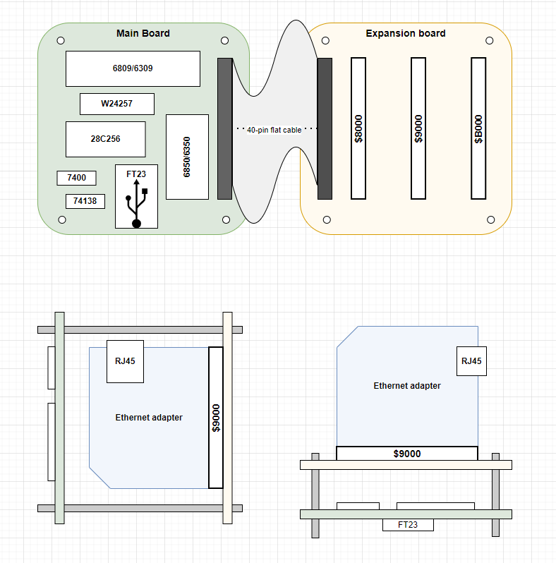
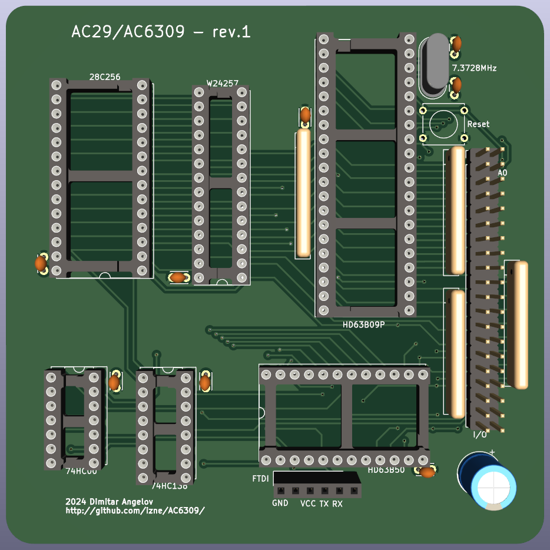

# AC6309 Platform
A minimalistic industrial computer core, based on Motorola 6809 architecture.

## Purpose
Proof of concept custom 8-bit industrial computer with minimal device count implementation. Modular, low-power design, allowing easy expansion and customization per use case.

## Dedication
AC29 is dedicated to my beloved father.

## AC29 projected configuration

## Prototype build 
* CPU: HD63B09 @ 1.8432MHz
* RAM: 32KB W24257A
* ROM: 8KB 28C256 (2x ROMs)
* UART: HD63B50 (1MBps) on FT23 USB Serial
* Address decoding: 74HCT00 & 74HCT138
* Expansion: 1x 40-pin header for expansion board with 3 slots mapped at $8000, $9000 and $B000
* Power over USB

## Example physical layout

## PCB Updates
Current state of PCB design:

## System memory map
|Address range|Device|Size|
|-------------|------|----|
|$0000-$7FFF|RAM|32KB|
|$8000-$8FFF|Extension port #1|4KB|
|$9000-$9FFF|Extension port #2|4KB|
|$A000-$AFFF|UART|4KB|
|$B000-$BFFF|Extension port #3|4KB|
|$C000-$FFFF|ROM|16KB|

The 32KB of RAM is allocated from the bottom of the address range $0000 to $7FFF.
The ROM is allocated at top 8KB of the address space starting $C000 to $DFFF.

The I/O mapping is allowing compatibility with existing BIOS images having ACIA on address 0xA000. 

## Writing the ROM image
Using the combination ROM image in Intel HEX format it needs first be turned into a binary image to be written to the EEPROM.
> objcopy -I ihex -O binary combined.hex combined.bin

Write the resulting .bin file using the specially created EEPROM programmer for AT28C-series EEPROMs. Or any other.
> promdude.exe -f combined.bin

As a note, burning the combined.bin (16K) onto 32K 28C256 has to be at the correct half. Optionally, a copy of combined.bin twice into the chip will do as well.

## ROM switching
As the firmware is 16K and 28C256 (32K) chips are nowadays more accesible, two firmware images could be stored in the full 32K capacity of the chip. A ROM switching key to be implemented on the board, to switch the higher or lower part of the chip to be "visible" (A14) at boot.

## Communication
The system communicates with a terminal via USB serial connection using the included ACIA device and its UART capability, coupled with an FTDI232 header. Terminal serial port settings: 115200 baud, 8n1, no hardware handshake yet.

## Software checklist
- [x] Run ASSIST09 and Extended BASIC
- [x] Write basic program (asm)
- [x] Cross-compile on host machine
- [x] Easy program transer via ASSIST09 Load (S19)
- [ ] Use of high level C code (CMOC)

## Hardware checklist
- [x] Breadboard prototype running
- [x] Revision 1 completion and PCB fabrication
- [ ] Extended addressing ("A" - four internal devices, "B" - four external devices)
- [ ] Expansion board with easy coupling
- [ ] 28C16-based address decoder
- [ ] Expansion card: Am9511 card (Am9511, 3MHz osc, 5to12Vbuck)
- [ ] Expansion card: Tape interface
- [ ] Expansion card: TMP68681 / 2x RS232 / 115200 bps (own osc)
- [ ] Expansion card: Ethernet adapter (ENC28J60)
- [ ] Expansion card: SAA1099 + TDA2822 audio interface
- [ ] Expansion card: VGA and PS/2 (Arduino)
- [ ] Expansion card: VGA and PS/2 (MC6845/HD6321)
- [ ] Expansion card: VGA (EF9367)
- [ ] Expansion card: Keyboard controller (XT, AT, PS/2, USB)

## Toolchain
* [ASM6809](https://www.6809.org.uk/asm6809/doc/asm6809.shtml)
* [A09](https://github.com/Arakula/A09)
* [AS09](https://gitlab.com/dfffffff/as09)
* [LWTOOLS-4.20](http://www.lwtools.ca/)
* [CMOC](http://perso.b2b2c.ca/~sarrazip/dev/cmoc.html)
* [MillFork](https://github.com/KarolS/millfork)

## Emulators
* [6809 online assembler](http://6809.uk/)
* [XRoar](https://www.6809.org.uk/xroar/online/)

- - - 
#### Prerequisites
The schematics and PCB design is made with [KiCad](http://kicad.org)

#### References and inspiration:
* [sbc689 by Jeff Tranter](https://github.com/jefftranter/6809)
* [6809 computer by Grant Searle](http://searle.x10host.com/6809/Simple6809.html)
* [HB6809 by Lindoran](https://github.com/lindoran/HB6809)
* [OMEN Kilo](https://github.com/omenmicro/kilo)
* [Chip Labels by Grant Searle](http://searle.x10host.com/labels/ChipLabels.pdf)

### Some great oldschool books:

* .pdf)

* .pdf)

* .pdf)

* .pdf)

* [The 6309 Book](https://colorcomputerarchive.com/repo/Documents/Books/The%206309%20Book%20(Burke%20&%20Burke).pdf)

https://colorcomputerarchive.com/repo/Documents/Books/Programming%20the%206809%20(Rodney%20Zaks%20and%20William%20Labiak).pdf

https://www.chibiakumas.com/6809/
